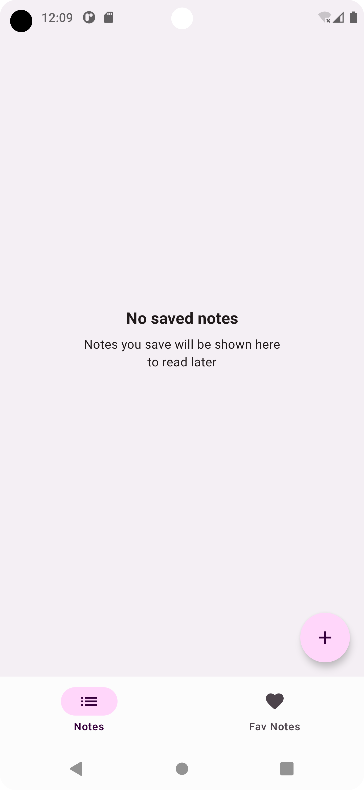
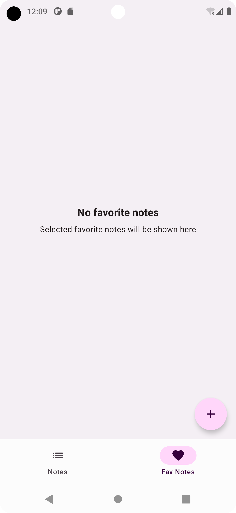

# Android App and SDK Template - 2023

A simple production ready(i.e NotesyApp) android app template that lets you create and upload APK to play store.

Todo app demonstrates to have basic components to ease app development. It should provide you component that are not 
available in android studio default template plugin.

The idea is to setup and deliver app in just few steps.

Feel free to raise your feedback/queries 

## Problem statement:

Creating an Android app from scratch is time-consuming and challenging. The Android app starter project aims to simplify the process by providing pre-designed screens, layout templates, and basic functionality, allowing developers to focus on building the app's unique features and functionality.

## Screenshots

  
  

## How to use (emoji): TBD

## Features(Architectural Characteristics): `WIP`

- Full Kotlin featured template
- MVVM + Clean architecture approach
- Template Project
- Jetpack Compose UI
- Coroutines - A concurrency design pattern library
- Github Actions - CI
- Fastlane setup
- Hilt 
- Retrofit - A HTTP client 
- Timber - Log
- Gson - JSON library 
- Material Components - Material Design 3
- Kotlin DSL - A build system for android environment 
- Detekt - Static code analysis 
- Gradle Doctor - A automated Gradle build scan plugin
- Compose Navigation - A navigation through app 
- Leak Canary - Memory Leak detection
- Data store - Data store solution alternative to preferences 
- Espresso, instrumentation and unit tests 
- Central version catalogue 
- UIToolKit - A re-usable design system for the app
- Firebase Performance
- Firebase Crashlytics
- App startup library
- Git Hooks setup 
- Strict Mode Policy violation setup 
- App benchmark

## Gradle setup:

## Static Analysis:

## Github Actions (CI) setup:

## Publishing:
A fastlane setup to automatically deploy apps to play store.

## Project Structure:

## Contributing:

## Code of conduct:

## Acknowledgement:
1. NowInAndroid - An app build by google team for android best practices

